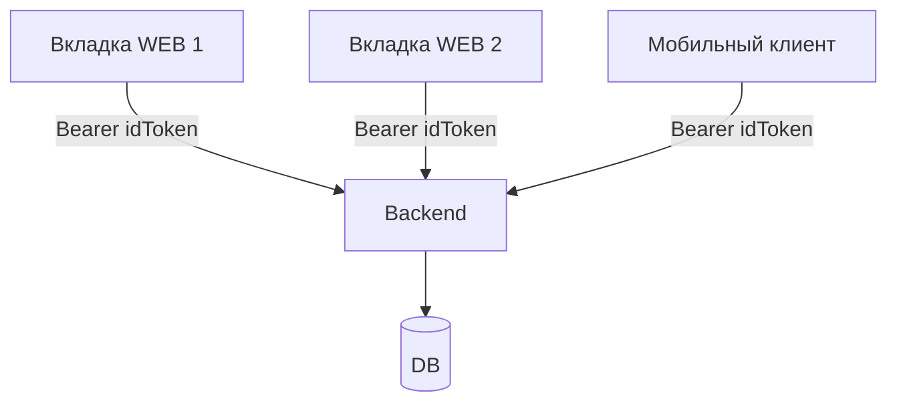

# Постановка: мультисессия для одного пользователя

Итоговый документ по задаче обеспечения корректной работы приложения в нескольких вкладках и на разных устройствах (веб и будущие мобильные клиенты).

---

## 1. Текущая реализация

### 1.1. Бэкенд

- **Файлы**: [backend/auth.py](backend/auth.py), [backend/main.py](backend/main.py), [backend/models.py](backend/models.py), [backend/schemas.py](backend/schemas.py), [backend/db.py](backend/db.py).
- **Пользователь и пароль**: модель `User` в `models.py`; хеширование PBKDF2 (`hash_password` / `verify_password`) в `auth.py`.
- **Access-токен**:
  - Создаётся `create_access_token(user_id)` в `auth.py`, TTL 7 дней.
  - Формат: `<payload_b64>.<signature_b64>`, payload: `{"sub": user_id, "exp": <ts>}`.
  - Хранится только на клиенте, в БД не логируется; проверка — через `verify_access_token` и `get_current_user`.
- **Авторизация в ручках**: `Depends(get_current_user)` в `main.py` и других модулях. `get_current_user` поддерживает: кастомный токен приложения, Google ID token, Яндекс OAuth token (при необходимости создаётся пользователь «на лету»).
- **Refresh-токенов и таблицы сессий нет**; выход реализован только по истечению `exp` или смене `auth_secret`.
- **Служебные сущности**: `OnboardingState` (по `user_id` + `device_type`: WEB/MOBILE), `TelegramLinkCode` — не являются сессиями.

### 1.2. Фронтенд

- **NextAuth**: [frontend/app/api/auth/[...nextauth]/route.ts](frontend/app/api/auth/[...nextauth]/route.ts).
  - Провайдеры: Google, Yandex, Credentials. Для Credentials — `POST` на бэкенд `/auth/login`, в ответ в JWT кладётся `data.access_token` как `user.idToken`.
  - В `jwt`-callback сохраняются `provider`, `idToken`; для Google — обновление по `refresh_token`.
  - В `session`-callback в сессию попадают `idToken` и `user.id`.
- **Провайдеры**: [frontend/app/providers.tsx](frontend/app/providers.tsx) — `SessionProvider`, `ThemeProvider`, `SidebarProvider`, `AccountingStartProvider`, `OnboardingProvider`.
- **Защищённый layout**: [frontend/app/(app)/layout.tsx](frontend/app/(app)/layout.tsx) — `useSession`, при отсутствии сессии редирект на `/login`, idle-таймер 10 мин с `signOut`.
- **Auth-layout**: [frontend/app/(auth)/layout.tsx](frontend/app/(auth)/layout.tsx) — при наличии сессии редирект на `/dashboard`.
- **API-клиент**: [frontend/lib/api.ts](frontend/lib/api.ts) — защищённые запросы через `authFetch`: `getSession()` → `session.idToken` → `Authorization: Bearer <idToken>`.
- **Контексты**:
  - [frontend/components/accounting-start-context.tsx](frontend/components/accounting-start-context.tsx) — дата начала учёта с бэкенда, флаг `dateSetupComplete` в `sessionStorage`.
  - [frontend/components/onboarding-context.tsx](frontend/components/onboarding-context.tsx) — статус онбординга с бэкенда (`device_type="WEB"`), локальное состояние шагов и модалки.

---

## 2. Проблемы текущего поведения

### 2.1. Остановка загрузки данных при нескольких вкладках

**Симптом**: при открытии второй вкладки приложения данные перестают грузиться на обеих вкладках (запросы не завершаются или падают с ошибкой).

**Причина** (локализована в коде и в поведении NextAuth):

1. **Каждый вызов `authFetch()` вызывает `getSession()`**  
   В [frontend/lib/api.ts](frontend/lib/api.ts) перед каждым запросом к бэкенду вызывается `getSession()`. В NextAuth по умолчанию после получения сессии выполняется **broadcast** (уведомление других вкладок через `BroadcastChannel`).

2. **Каскад refetch сессии во всех вкладках**  
   При получении broadcast каждая вкладка в `SessionProvider` вызывает `_getSession({ event: "storage" })`, то есть снова запрашивает сессию с сервера. В результате:
   - множество параллельных запросов к `/api/auth/session`;
   - при переключении вкладки срабатывает ещё и **refetchOnWindowFocus** (по умолчанию `true`), что добавляет дополнительные refetch.

3. **Конкуренция и ошибки**  
   При большом числе одновременных вызовов `getSession()` и refetch возможны таймауты или ошибки сети. В NextAuth при ошибке `fetchData("session", ...)` возвращает `null`. Тогда `authFetch` не получает `idToken` и выбрасывает `"No idToken in session"`, из‑за чего загрузка данных в одной или обеих вкладках перестаёт работать.

4. **Отсутствие изоляции запросов между вкладками**  
   Общий канал синхронизации сессии между вкладками (broadcast + refetch) при активном использовании API в двух вкладках создаёт избыточную нагрузку и нестабильность вместо изоляции «одна вкладка — свои запросы».

**Внесённые изменения**:

- В **authFetch** вызов заменён на **`getSession({ broadcast: false })`**, чтобы обычные API-запросы не рассылали broadcast и не провоцировали refetch сессии в других вкладках.
- В **SessionProvider** задано **`refetchOnWindowFocus={false}`**, чтобы переключение между вкладками не вызывало лишний refetch сессии. При явном выходе (`signOut`) NextAuth по-прежнему рассылает broadcast, и остальные вкладки обновляют состояние сессии.

В результате каждая вкладка стабильно получает данные с бэкенда, при этом логин/логаут между вкладками продолжают синхронизироваться через broadcast при signIn/signOut.

---

## 3. Целевая модель мультисессии

- Вкладки **независимы** по навигации и локальному UI-состоянию; переходы и фильтры в одной вкладке не меняют другую.
- Данные с бэкенда (транзакции, активы, цели, онбординг, дата начала учёта) общие для пользователя; при обновлении страницы или повторном запросе все вкладки видят актуальные данные.
- Редиректы по **auth** (login/logout, истечение токена) допускают синхронное поведение во вкладках (через NextAuth); при этом маршрут уже открытой вкладки не должен самопроизвольно меняться из‑за логина в другой вкладке.
- Онбординг и дата начала учёта сохраняют семантику **per device_type** (WEB/MOBILE).
- Не требуется сложный realtime (WebSocket/SSE); достаточно корректности при запросах и обновлении страницы.

---

## 4. Требуемые изменения и доработки

### 4.1. Фронтенд: устранение остановки загрузки при нескольких вкладках (выполнено)

- Причина описана в разделе 2.
- Реализовано: `getSession({ broadcast: false })` в `authFetch`, `refetchOnWindowFocus={false}` у `SessionProvider`.

### 4.2. Фронтенд: поведение auth-редиректов в мультисессии

- **Текущее поведение** (оставляем без изменений):
  - В [frontend/app/(auth)/layout.tsx](frontend/app/(auth)/layout.tsx): при `status !== "loading"` и наличии `session` выполняется `router.replace("/dashboard")` только в текущей вкладке.
  - В [frontend/app/(app)/layout.tsx](frontend/app/(app)/layout.tsx): при отсутствии сессии — `router.replace("/login")` только в текущей вкладке; idle-таймер 10 мин вызывает `signOut` локально, после чего NextAuth синхронизирует logout по вкладкам через broadcast.
- **Желаемое**: редиректы зависят только от локальных `session` и `router`; кросс-вкладочных побочных эффектов от редиректов нет. Текущая реализация этому соответствует.

### 4.3. Фронтенд: граница локального и общего состояния

- **Локальные по вкладке** (не синхронизируются между вкладками):
  - `sessionStorage`: ключ `finapp-date-setup-complete` (флаг завершения настройки даты в этой вкладке).
  - Состояние в памяти: открытие/закрытие модалок, текущий шаг онбординга, фильтры, выбранные активы на страницах — каждый layout/страница в своей вкладке.
- **Общие (источник правды — бэкенд)**:
  - Данные пользователя: транзакции, активы, цели, категории, контрагенты, `accounting_start_date`, `OnboardingState` (по `device_type`). При следующем запросе или обновлении страницы все вкладки получают актуальные данные.
- **Сессия**: общая по домену (cookie), но каждая вкладка использует её независимо для своих запросов; после внесённых правок массовый refetch при действиях в другой вкладке не вызывается.

### 4.4. NextAuth и idle-logout в мультисессии

- NextAuth синхронизирует статус сессии между вкладками через cookie и `BroadcastChannel` (при signIn/signOut). Это поведение сохраняем: logout в одной вкладке приводит к обновлению сессии в других.
- Idle-logout: в каждой вкладке свой таймер 10 мин; по истечении вызывается `signOut`, что через NextAuth приводит к выходу и в остальных вкладках. Таймер привязан к событиям только своей вкладки — это ожидаемо и оставляем без изменений.

### 4.5. Бэкенд: модель сессий и мультисессия

- На данном этапе **модель не меняется**: используются self-contained access-токены; один и тот же пользователь может иметь несколько параллельных валидных токенов (разные вкладки/устройства). Проверка — через `get_current_user` на каждый запрос.
- Централизованной таблицы сессий и точечной инвалидации токенов **пока не вводим**. Архитектура фронтенда и API не должна препятствовать их добавлению позже.
- **Возможное развитие** (вне текущей задачи): таблица `user_sessions` / `refresh_tokens`, эндпоинты `/auth/refresh`, `/auth/logout_all`, `/auth/logout_session`, привязка access-токена к `session_id` или `token_version` для выборочной инвалидации.

### 4.6. Мобильные клиенты: совместимость с мультисессией

- Мобильные приложения рассматриваются как отдельные потребители access-токена того же формата, что и веб.
- **Вариант A**: мобильное приложение открывает веб-поток авторизации (NextAuth) в web-view/браузере и после логина получает `idToken` (access-токен бэкенда) для своих запросов.
- **Вариант B**: мобильное приложение общается с бэкендом напрямую (`/auth/login`, передача Google/Яндекс токенов), получает и хранит access-токен того же формата.
- Оба варианта совместимы с мультисессией: бэкенд не привязывает токен к одному «устройству», несколько одновременных сессий (веб + мобильный) допустимы.

---

## 5. Ссылки на ключевые файлы

| Назначение | Путь |
|------------|------|
| Access-токен, get_current_user | [backend/auth.py](backend/auth.py) |
| Роуты auth, защита эндпоинтов | [backend/main.py](backend/main.py) |
| NextAuth config, JWT/session callbacks | [frontend/app/api/auth/[...nextauth]/route.ts](frontend/app/api/auth/[...nextauth]/route.ts) |
| SessionProvider, провайдеры | [frontend/app/providers.tsx](frontend/app/providers.tsx) |
| Защищённый layout, idle-logout | [frontend/app/(app)/layout.tsx](frontend/app/(app)/layout.tsx) |
| Auth layout, редирект на dashboard | [frontend/app/(auth)/layout.tsx](frontend/app/(auth)/layout.tsx) |
| authFetch, getSession | [frontend/lib/api.ts](frontend/lib/api.ts) |
| Контекст даты учёта | [frontend/components/accounting-start-context.tsx](frontend/components/accounting-start-context.tsx) |
| Контекст онбординга | [frontend/components/onboarding-context.tsx](frontend/components/onboarding-context.tsx) |
